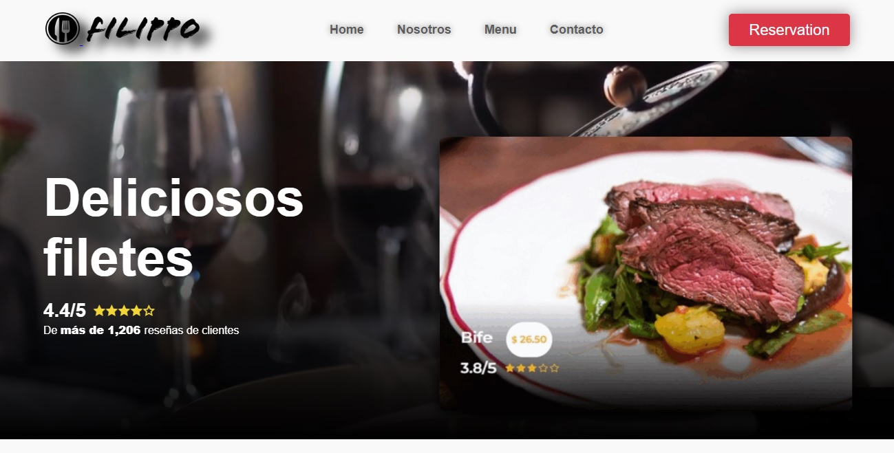

# Introducción:

Página informativa sobre Filippo's bar & resto. Incluye 3 secciones y un modal para la reservación de mesas. Todo el proyecto es web responsive. 

## Características principales
* Reservación
Los usuarios pueden reservar una mesa a través del modal de reserva. Pueden establecer el día, el horario y los comensales.

* Formulario de contact
Ubicado en la sección de contacto, se puede enviar un mensaje directo sobre cualquier tema.

* Menú
En la sección de Menú se muestran diferentes platos desde desayunos hasta cenas.

* Suscripción
Contiene un campo para suscribirse y recibir las novedades con respecto alm lugar y los menús.

## Demo
https://filippo.vercel.app/

## Estado
El proyecto se encuentra en un MVP inicial y funcional. Actualmente soporta el uso desde dispositivos móviles, tablets, laptops y PCs siendo completamente responsivo. Permite navegar por las distintas páginas y completar los formularios con validaciones. 

### Tecnologías

- Frontend:

    - **Javascript**
    - **CSS**

- Librerías Frontend:

    - **Google Maps**: para mostrar el mapa en contactos con la ubicación
    - **RemixIcon**: usado para los iconos

- Equipo de desarrollo:

    | Rol                  | Nombre               | Redes                                                                                                                             |
    | :------------------- | :------------------- | :-------------------------------------------------------------------------------------------------------------------------------- |
    | `Front End`          | Diana Paola Iturria  | [![GitHub]](https://github.com/DianaIturria)                                                                                      |
    | `Front End`          | Yago Gomez           | [![GitHub]](https://github.com/YagoGomez83) [![linkedin]](https://www.linkedin.com/in/yago-gomez-320087224/)                      | 
    | `Front End` & `PM`   | Kevin Noviello       | [![GitHub]](https://github.com/kjnoviello) [![linkedin]](https://www.linkedin.com/in/kevinjoelnoviello/)                          |
    | `Front End`          | Martin Cespedes      |                                                                                                                                   |
 